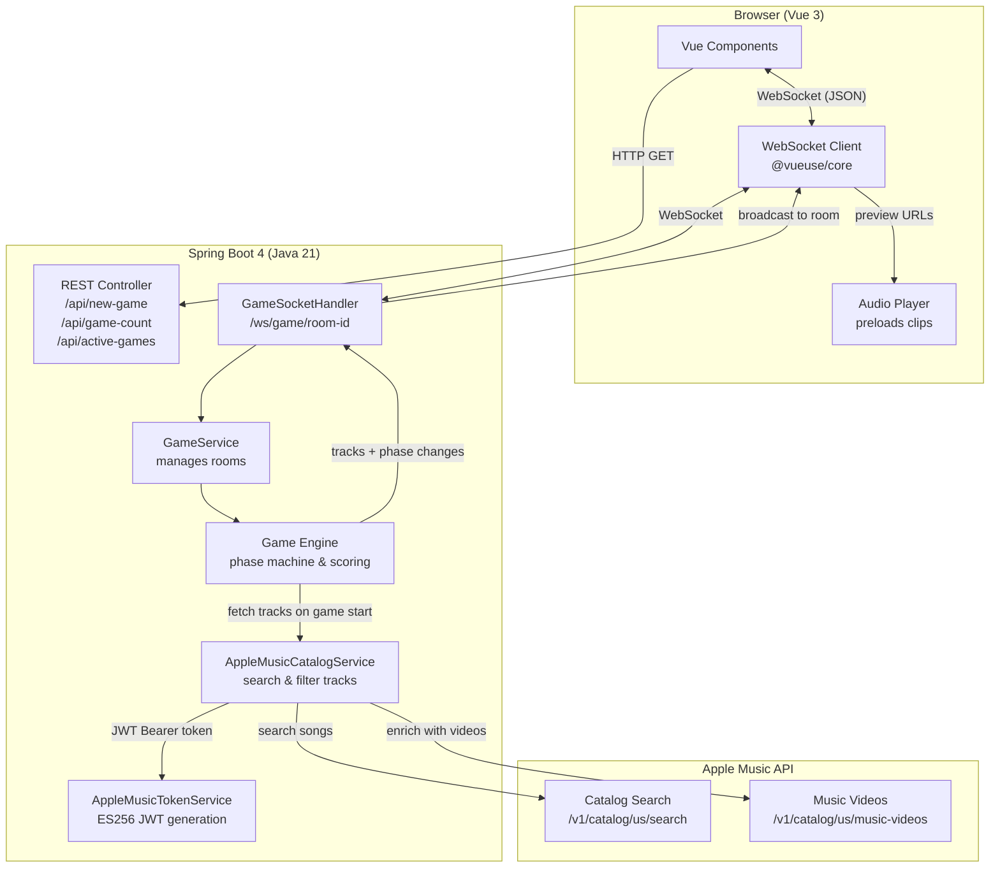
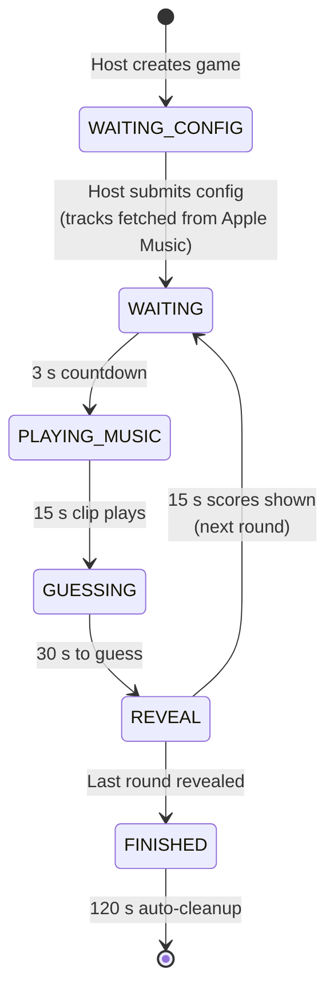
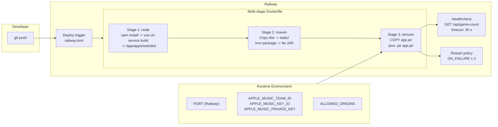

# Hit Trivia

A real-time multiplayer music trivia game. Create a game, invite friends with a QR code, and see who can guess the song from a short clip.

**Live:** [hit-trivia-production.up.railway.app](https://hit-trivia-production.up.railway.app)

## How It Works

1. One player creates a game and configures the genre, decade, obscurity, and number of rounds
2. Other players join by scanning the QR code or sharing the link
3. Each round: a short music clip plays → everyone guesses the title, artist, or album → scores are revealed
4. After all rounds, the final scoreboard shows the winner

## Tech Stack

| Layer    | Technology                                               |
| -------- | -------------------------------------------------------- |
| Frontend | Vue 3 (Options API), Vue Router, @vueuse/core            |
| Backend  | Java 21, Spring Boot 4, WebSocket (TextWebSocketHandler) |
| Music    | Apple Music MusicKit API (track previews & music videos) |
| Build    | Nx monorepo, Maven, Docker multi-stage build             |
| Deploy   | Railway (Dockerfile builder)                             |

## Project Structure

```
apps/
  web/           Vue 3 frontend (served as static files from Spring Boot)
  backend/       Spring Boot backend (WebSocket game server + REST API)
```

## Local Development

```bash
# Install frontend dependencies
cd apps/web && npm install && cd ../..

# Run both frontend and backend in parallel
npm run dev
```

_Ensure that [Java 21](https://www.oracle.com/java/technologies/javase/jdk21-archive-downloads.html) is installed and [Maven](https://maven.apache.org/)_

The frontend dev server runs on `http://localhost:3000` and the backend on `http://localhost:8080`.

### Environment Variables

| Variable                  | Description                                | Default                 |
| ------------------------- | ------------------------------------------ | ----------------------- |
| `APPLE_MUSIC_TEAM_ID`     | Apple Developer Team ID                    | —                       |
| `APPLE_MUSIC_KEY_ID`      | MusicKit private key ID                    | —                       |
| `APPLE_MUSIC_PRIVATE_KEY` | MusicKit private key (PKCS8, Base64)       | —                       |
| `ALLOWED_ORIGINS`         | CORS allowed origins (comma-separated)     | `http://localhost:3000` |
| `SPRING_PROFILES_ACTIVE`  | Spring profile (`local` / `production`)    | `local`                 |
| `PORT`                    | Server port (set automatically by Railway) | `8080`                  |

For local development, create `apps/backend/src/main/resources/application-local.properties` with your Apple credentials:

```
apple.music.team-id=1234asdf
apple.music.key-id=1234asdf
apple.music.private-key=1234asdf
```

## Docker

Uses the same `application-local.properties` you already have for local development — no extra config needed.

```bash
docker compose up --build
```

Open `http://localhost:8080`. The Vue frontend and backend API are served from the same origin.

The multi-stage Dockerfile builds the Vue frontend, packages it into the Spring Boot static resources, and produces a minimal JRE image.

## Architecture



### Game Phase Lifecycle



## Deployment



## Design Decisions

**All tracks sent upfront** - When a game starts, every client receives the full track list. During each WAITING phase before PLAYING_MUSIC, the browser preloads the next audio clip so there's zero buffering.

**Server-authoritative timing** - All phase countdowns use server timestamps. Clients compute progress bars from `startTimestamp` / `endTimestamp`, so even a page reload shows the correct remaining time.

**Reconnect-first** - Player ID stored in localStorage. On page reload, the client auto-reconnects to the WebSocket and the server sends the full current game state (phase, tracks, round, scores). The experience is seamless.

**Mute by default for guests** - Only the host plays music out loud by default. Other players are muted to avoid cacophony in the same room. Everyone can toggle with the floating speaker button.

**Music Engine** - Currently using the Top lists from Apple Music for genre and decade.
